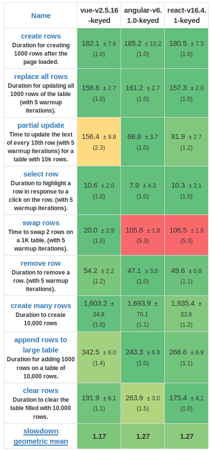
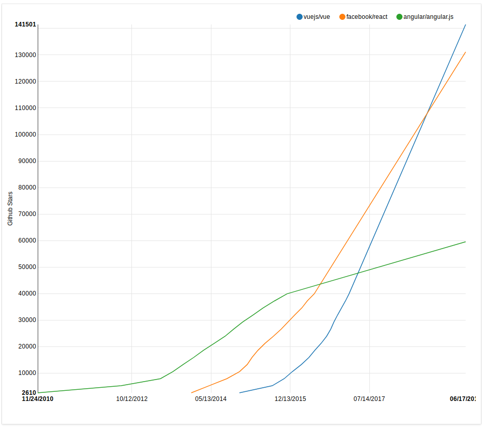
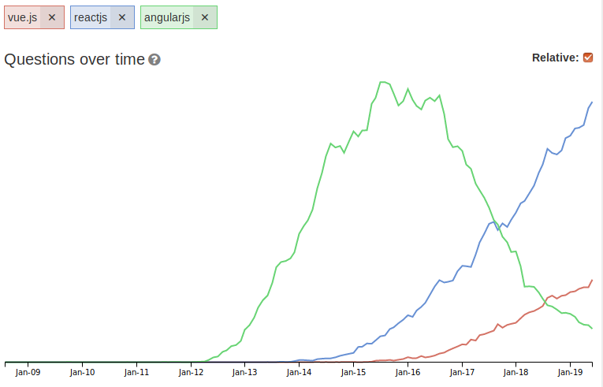
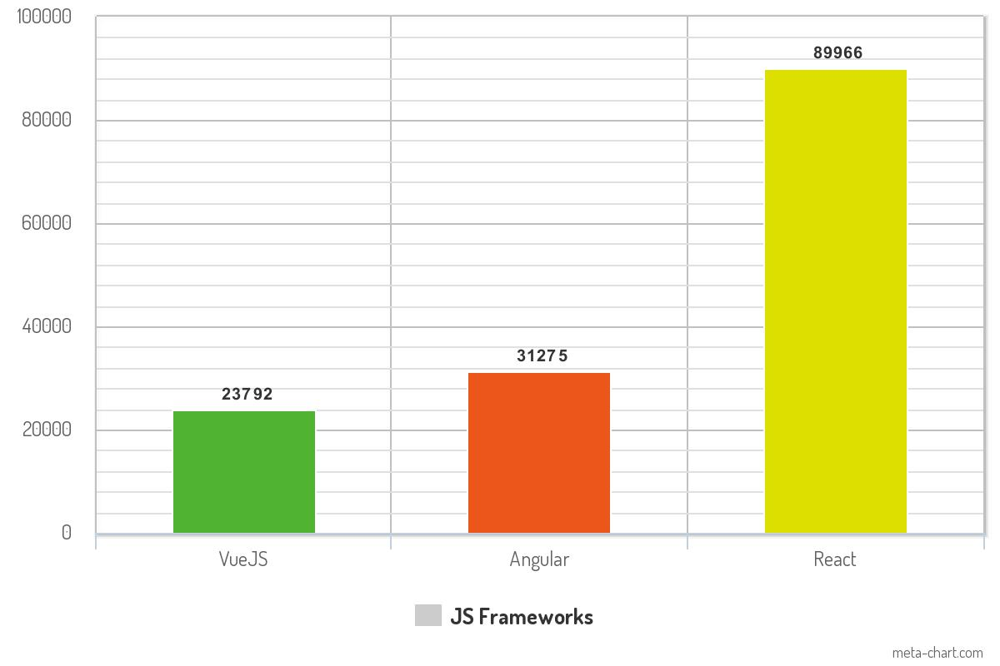

## VueJS (vs Matestack)

---

@snap[north span-40]
## Inhalt
@snapend

@snap[west span-40 text-center]

Lernkurve
Code Style
Single File Components
Performance
Flexibilität

@snapend

@snap[east span-40 text-center]

Mobile
Community
Maturity
Support

@snapend

---

## Lernkurve

Bewährte Konzepte wurden von React und Angular angeeignet
Für Entwickler mit Erfahrungen in React oder Angular dadurch schnell erlernbar

+++

## Lernkurve

Gute Dokumentation
Doku ist klarer definiert als bei React
Viele Fragen lassen sich anhand der Doku schnell beantworten

---
## Code Style

Mix aus funktionaler und objektorientierter Programmierung
separiert HTML, JS und CSS. 
Bietet auch JSX-Style an
Komponenten-Lifecycle ist klar und intuitiv

---
## Single File Components

Single File Components sind in 3 Bereiche separiert:
```javascript
<template>, <script> und <style>
```

jeder Bereich enthält den entsprechenden Code-Type

---

### template
```
<template lang="pug>
  #app
    template(v-for="item in items")
      v-img(:src='item.image', height='200px')
        .headline {{ item.count }} {{ item.headline }}
          span.grey--text {{ item.subHeadline }}
</template>
```

pug Templates analog zu slim  
Two-Way Data Binding

+++

### script
```javascript
```

+++

## style

```
<style>
```

Im Style der Komponente wird das CSS hinterlegt
durch ``` <style lang="scss"> ``` kann man  

---

@snap[west span-40 text-center]
## Performance

Größe der Vue-Bibliothek: 31KB
@snapend

@snap[east span-40 text-center]

@snapend

---

## Flexibilität

Im Core sind die wichtigsten Bestandteile bereits integriert  
Darüber hinaus gibt es einige sinnvolle Erweiterungen


### Vuex für das State-Management
Es gibt einen zentralen Store  
In diesem wird der Zustand der Anwendung gespeichert
```javascript
const store = new Vuex.Store({
  state: {
    count: 0
  },
  mutations: {
    increment (state) {
      state.count++
    }
  }
})
```
+++
### Vue Router für das URL-Management

```javascript
import Posts from '../components/posts/index.vue'

export const routes = [
  { path: '/posts', component: Posts }
```

+++

### Vue Router für das URL-Management

```
router-link(to="/posts")
  | Index
router-view
```

Beim Klick auf Index wird dann die Komponente Posts in router-view gerendered

---

## Mobile

Mehrere Optionen Native Apps zu bauen
Nativescript, Weex und Quasar 

---
## Community

wachsende Zahlen in relevanten Feldern

+++

### Github Stars History



+++

### Stackoverflow-Tags History

 

+++

### NPM Packages



---
## VueJS Production Ready?

Vue wurde im Feburar 2014 released
Vue wird laut SimiliarTech von ~75.000 unique Domains verwendet (React: ~263.000)

## VueJS Production Ready?
Vue wird unter anderem von folgenden Unternehmen verwendet:

9GAG  
Gitlab  
Grammarly  
Nintendo  
---

## Support

Vue ist eine unabhängige Bibliothek
23 Entwickler im Vue Team
Roadmap kann im Github-Repository eingesehen werden

---
## Zusammenfassung

---
## Pros

* Vue's Kernmodul funktionieren sehr gut
* Schnelle Einarbeitung
* FEDs und BEDs können sich gut und schnell zurechtfinden

---
## Cons

* weniger Plugins und Tools als bei React oder Angular
* kleinere Community

---
## Single File Components

+++
Components können genutzt werden um gekapselte Funktionalitäten zu erstellen 

+++
Components können in andere Components geladen werden und verhalten sich wie Partials

+++
Mit Vue Router können Seitenaufrufe gehandelt werden

+++
```
router-view
```
ermöglicht es die Components zu rendern.
+++
Im route.js werden die Routes deklariert
```
export const routes = [
  { path: '/dashboard', component: Dashboard, children: [
    { path: '/dashboard/posts/index', component: Posts },
  ]},
];
```

+++
Die Child-Component Posts wird im Dashboard mit 
```
router-view
```
wiederum geladen
+++
Es kann mehrere Child-Components geben. Diese können wiederum Child-Components besitzen
+++
Um den State einer App handhaben zu können, wird Vuex genutzt
 
---